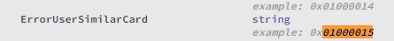
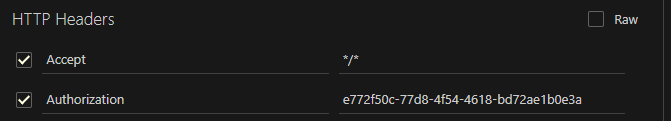

# API Ubio-Alpeta
### Documentos oficiais em [`docs/`](/docs)

### Observações
1. Para o uso da API, __você deve__ cadastrar uma serial key válida.

2. No caso de retornar um código extenso ou um número aleatório, você deve converter o valor do result code de DECIMAL para HEXADECIMAL e consultar os campos ErrorCode no swagger para saber a razão do erro respectivo.
Exemplo:
  ```json
    "Result": {
      "ResultCode": 16777237
    }
  ```
  #### `16777237 --> 0x01000015`
  

3. Você pode ver todos os endpoints e como interagir através do swagger em `http://192.168.x.xx:9004/v1/docs`

### Configuração de Host
#### Adicionando o IP da API Alpeta
Para mudar o acesso ao IP do host, modifique os arquivos:
`C:\Program Files\UnionCommunity\UBio Alpeta\docs\swagger.json` e
`C:\Program Files\UnionCommunity\UBio Alpeta\docs\swagger_kr.json`

Modifique em ambos, o campo `host: '192.168.x.xx:9004' ` com o IP do seu host.

-----------------

## Gerenciamento de sessões
#### Login
- `POST http://192.168.x.xx:9004/v1/login` : Retorna seu usuário se o login for correto e um token (UUID)
  #### Requisição
  ```json
  {
    "userId": "1234",
    "password": "1111",
    "userType": 0
  }
  ```
  #### Resposta
  Caso o login seja feito corretamente.
  ```json
  {
    "Result": {
      "ResultCode": 0
    }
  }
    "AccountInfo": {
    "UserID": 1000000000000000000,
    "UniqueID": "",
    "Uuid": "e772f50c-77d8-4f54-4618-bd72ae1b0e3a",     <--- Utilizar no campo authorization do header
    "Name": "Master",
    "LoginPW": "",
    "Privilege": 1,
    "FirstLoginFlag": 0,
    "ServerID": 11,
    "LoginAllowed": 1,
    "LoginFailCount": 0,
    "WebLogin": 1,
    "VisitLogin": 0,
    "LoginIP": "192.168.1.33",
    "LoginTime": "2023-10-11 09:41:55",
    "LastLoginIP": "192.168.1.33",
    "LastLoginTime": "2023-10-10 14:47:01",
    "JwtToken": "",
    "UserAff": ""
  },
  ...
  ```
Você então **deverá** utilizar o UUID para ter autorização para os demais endpoints.
  

-----------------

## Gerenciamento de Licenças
#### Ativar Licença
- `POST http://192.168.x.xx:9004/v1/license/activate` : Ativa a licença do dispositivo
  #### Requisição
    ```json
  {
    "Mode": 1,
    "ProductID": 1,
    "SerialKey": "XXXXXX-XXXXXX-XXXXXX-XXXXXXXX",
    "CustomerID": "customerid",
    "CompanyName": "company name",
    "ClientKey": ""
  }
    ```
  #### Resposta
  Caso a licença seja ativada corretamente.
  ```json
  {
    "Result": {
      "ResultCode": 0
    }
  }
  ```

O modo de ativação pode é online (`"Mode": 1`).
Você deverá adicionar uma serial key, ela será evaluada externamente e retornará uma licença válida para o Alpeta.
O CustomerID é obrigratório, mas pode ser qualquer valor.

#### Requisitar Licença
- `GET http://192.168.x.xx:9004/v1/license` : Requisita a licença do registrada
#### Resposta
Caso a licença esteja registrada corretamente.
```json
{
  "Result": {
    "ResultCode": 0
  },
  "LicenseInfo": {
    "LicenseType": 10,
    "LicenseKey": "XXXXXX-XXXXXX-XXXXXX-XXXXXX-XX",
    "SerialKey": "XXXXXX-XXXXXX-XXXXXX-XXXXXXXX",
    "CustomerID": "customerid",
    "CompanyName": "company name",
    "MacAddress": "",
    "ExpireAt": "",
    "Status": " 1: License expiration "
  }
}
```

-----------------

## Gerenciamento de Visitas
### Visitante
#### Requisitar Visita
  `POST http://192.168.x.xx:9004/v1/visitor/visitApplication` : Requisita uma visita
  #### Requisição
  ```json
  {
  "VisitInfo": {
    "StartTime": "2020-05-11 00:00:00",
    "EndTime": "2020-05-11 23:59:00",
    "Purpose": "test",
    "VisitTargetID": 1,
    "VisitTargetUserName": "1",
    "VisitTargetPositionName": "",
    "VisitTargetGroupName": "",
    "Password": "1111"
  },
  "VisitorList": [
    {
      "FirstName": "Fname",
      "LastName": "Lname",
      "Birthday": "20200404",
      "Mobile": "010-1234-1234",
      "Company": "company",
      "CarNumber": "",
      "Email": "123@test.com",
      "Photo": ""
    }
  ],
  "ItemList": [
    {
      "ItemType": 1,
      "NameType": 1,
      "Name": "test",
      "InOut": 1,
      "SerialNum": "1234",
      "Model": "test",
      "Purpose": "test",
      "Unit": "1234",
      "Count": 4,
      "Desc": "test"
    }
  ]
}
  ```
- `VisitInfo`
  Quem será visitado, quando e o motivo.
- `VisitorList`
  Lista de visitantes, com informações pessoais.
- `ItemList`
  Lista de itens que serão levados para a visita.

#### Resposta
Caso a visita seja registrada corretamente.
```json
{
  "Result": {
    "ResultCode": 0
  }
}
```
Consultando o swagger, você pode ver que é possível deletar ou cancelar uma visita, atualizar uma visita. Além de também poder convidar para uma visita utilizando um e-mail.
Observe, que existem duas URIs, `/visit` e `/visitor`.  
A diferença é que `/visit` é para gerenciar visitas registradas e `/visitor` é para gerenciar requisições relacionadas a visitas.

-----------------

## Gerenciamento de Usuários

#### Requisitar Usuário
- `GET http://192.168.x.xx:9004/v1/users` : Requisita um usuário
  Você poderá utilizar e passar vários parâmetros.  
  `http://192.168.x.xx:9004/v1/users?groupID=1&subInclude=true&offset=0&limit=10`
  1. `groupID` : ID do grupo que o usuário pertence
  2. `subInclude` : Incluir subgrupos
  3. `offset` : Offset da lista de usuários, para paginação
  4. `limit` : Limite de usuários por página

Você pode ver todos os parâmetros extras e o que eles fazem no swagger.

#### Resposta
```json
{
  "Result": {
    "ResultCode": 0
  },
  "Total": {
    "Count": 0
  },
  "UserList": [
    {
      "ID": "0000001",
      "UniqueID": "9999",
      "Name": "unioncomm",
      "AuthInfo": [
        1,
        2,
        4,
        0,
        0,
        0,
        0,
        0
      ],
      "Privilege": 1,
      "RegistDate": "2018-04-11T01:30:02",
      "ExpireDate": "2018-04-11T01:30:02",
      "GroupCode": 0,
      "AccessGroupCode": 0,
      "TimezoneCode": 0,
      "BlackList": 0,
      "FPIdentify": 0,
      "FaceIdentify": 0,
      "APBZone": 0,
      "EmployeeNum": "A20180100001"
    }
  ]
}
```

#### Criar Usuário
- `POST http://192.168.x.xx:9004/v1/users` : Cria um usuário
  #### Requisição
  ```json
  {
    "UserInfo": {
      "ID": "9999",
      "UniqueID": "9999",
      "Name": "User9999",
      "AuthInfo": [
        1,
        2,
        3,
        0,
        0,
        0,
        0,
        1
      ],
      "Privilege": 1,
      "CreateDate": "2018-04-11 01:30:02",
      "UsePeriodFlag": 0,
      "RegistDate": "2018-04-11 01:30:02",
      "ExpireDate": "2018-04-11 01:30:02",
      "Password": "1111",
      "GroupCode": 0,
      "AccessGroupCode": 0,
      "UserType": 0,
      "TimezoneCode": 0,
      "BlackList": 0,
      "FPIdentify": 0,
      "FaceIdentify": 0,
      "DuressFinger": [
        1,
        2,
        3
      ],
      "Partition": 0,
      "APBExcept": 0,
      "APBZone": 0,
      "WorkCode": "****",
      "MealCode": "****",
      "MoneyCode": "****",
      "MessageCode": 0,
      "VerifyLevel": 0,
      "PositionCode": 1000,
      "Department": "Department",
      "LoginPW": "Login Password",
      "LoginAllowed": 0,
      "Picture": "Picture Data ",
      "EmployeeNum": "A20180100001",
      "Email": "ABC@gmail.co.kr",
      "Phone": "***-****-****"
    },
    "UserFPInfo": [
      {
        "FingerID": 1,
        "MinConvType": 3,
        "TemplateIndex": 1,
        "TemplateData": "TestData"
      },
      {
        "FingerID": 1,
        "MinConvType": 3,
        "TemplateIndex": 2,
        "TemplateData": "TestData"
      }
    ],
    "UserFaceInfo": [
      {
        "UserID": 1,
        "Index": 1,
        "Type": 0,
        "SubIndex": 1,
        "TemplateSize": 4042,
        "TemplateData": ""
      },
      {
        "UserID": 1,
        "Index": 1,
        "Type": 0,
        "SubIndex": 2,
        "TemplateSize": 4042,
        "TemplateData": ""
      },
      {
        "UserID": 1,
        "Index": 1,
        "Type": 0,
        "SubIndex": 3,
        "TemplateSize": 4042,
        "TemplateData": ""
      },
      {
        "UserID": 1,
        "Index": 1,
        "Type": 0,
        "SubIndex": 4,
        "TemplateSize": 4042,
        "TemplateData": ""
      },
      {
        "UserID": 1,
        "Index": 1,
        "Type": 0,
        "SubIndex": 5,
        "TemplateSize": 4042,
        "TemplateData": ""
      }
    ],
    "UserCardInfo": [
      {
        "CardNum": "TestNum"
      }
    ],
    "UserFaceWTInfo": [
      {
        "UserID": 1,
        "TemplateSize": 1,
        "TemplateData": "TestData",
        "TemplateType": 1
      }
    ],
    "UserIrisInfo": [
      {
        "UserID": 1,
        "EyeType": 1,
        "TemplateSize": 1,
        "TemplateData": ""
      }
    ]
  }
  ```
  #### Resposta
  ```json
  {
    "Result": {
      "ResultCode": 0
    }
  }
  ```
Pode se observar que existem inúmeros parâmetros para criar um usuário.
1. `UserInfo` : Informações do usuário
2. `UserFPInfo` : Informações de impressão digital
3. `UserFaceInfo` : Informações de face
4. `UserCardInfo` : Informações de cartão
5. `UserFaceWTInfo` : Informações de face (WT)
6. `UserIrisInfo` : Informações de íris

O swagger pode apontar quais são necessárias e quais são opcionais para o registro.

Observa-se que através do sawgger, métodos CRUD são disponibilizados para gerenciar usuários, inclusive atualizar atributos específicos, verificar se uma ID já existe e etc.